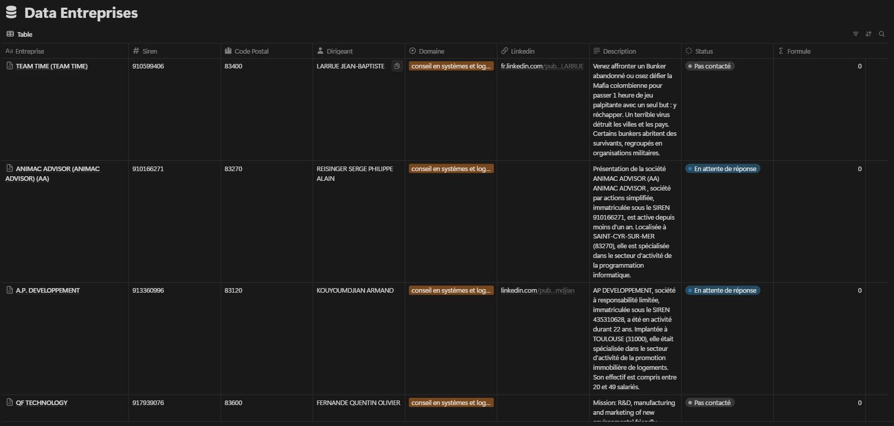
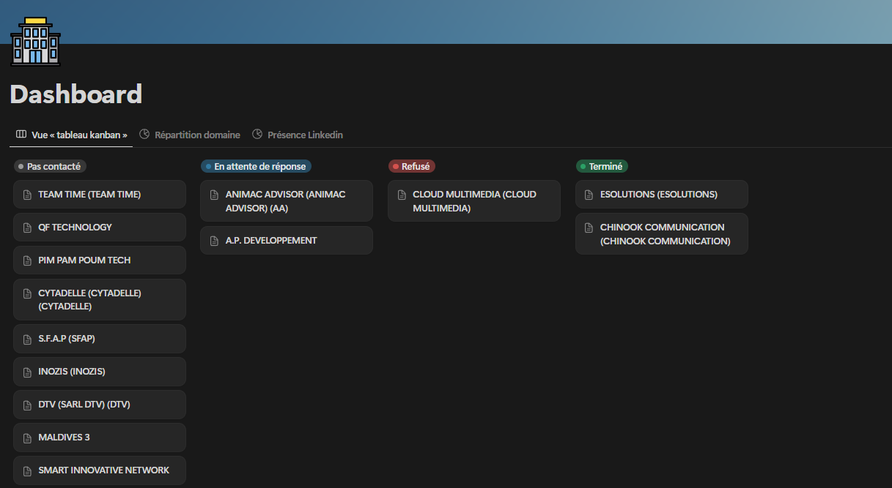
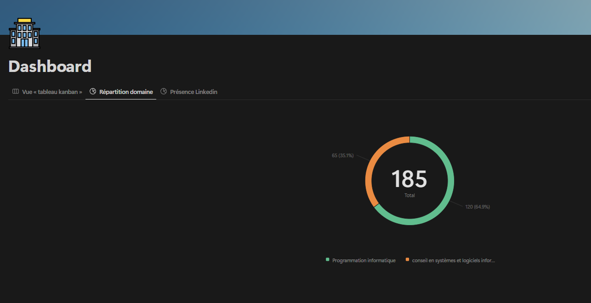
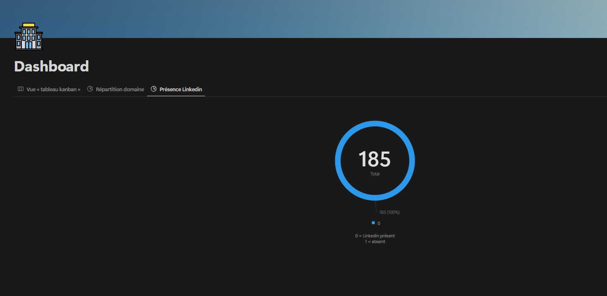

# Projet d'Intégration et Génération de Lettres de Motivation pour Entreprises

Ce projet est une solution automatisée qui permet de :

- Récupérer des informations sur des entreprises via l'API publique du gouvernement.
- Enrichir ces données grâce à des recherches sur DuckDuckGo.
- Générer une lettre de motivation personnalisée pour chaque entreprise en utilisant l'API d'Ollama.
- Intégrer automatiquement ces informations dans une base Notion.

## Fonctionnalités

- **Récupération des entreprises** :  
  Extraction des informations de PME basées sur le code NAF et le département via l'API [recherche-entreprises.api.gouv.fr](https://entreprises.data.gouv.fr/).

- **Enrichissement des données** :  
  Recherche d'URL LinkedIn et de descriptions d'entreprise via DuckDuckGo.

- **Génération de lettres de motivation personnalisées** :  
  Utilisation de votre CV et d'un exemple de lettre (fichiers PDF) pour générer une lettre adaptée à chaque entreprise grâce à l'API d'Ollama (modèle "llama3.2").

- **Intégration dans Notion** :  
  Création automatique de pages dans une base Notion avec les informations de l'entreprise et la lettre générée, en gérant le découpage des textes pour respecter les contraintes de l'API.

- **Configuration via fichier d'environnement** :  
  Récupération des identifiants sensibles (token Notion et ID de la base) depuis un fichier `config.env`.

## Choix Techniques et Justifications

Pour répondre aux exigences du projet, plusieurs choix techniques ont été faits :

- **Langage de programmation – Python** :  
  Python est choisi pour sa simplicité et son riche écosystème de bibliothèques qui facilitent l'intégration d'API, le traitement de données et l'automatisation de tâches. Il permet également un prototypage rapide et une bonne lisibilité du code.

- **Bibliothèque `requests`** :  
  Utilisée pour effectuer des requêtes HTTP vers l'API du gouvernement afin de récupérer les données des entreprises. Elle offre une interface simple et puissante pour interagir avec les services web.

- **Utilisation de `pandas`** :  
  La gestion des données tabulaires (entreprises, Siren, description, etc.) est facilitée par `pandas`, qui permet de manipuler et filtrer efficacement les données, notamment lors de la suppression des doublons et du filtrage des entreprises déjà présentes dans Notion.

- **Recherche d'informations avec `duckduckgo_search`** :  
  Cette bibliothèque permet d'enrichir les informations des entreprises (comme les URL LinkedIn et les descriptions) en effectuant des recherches sur DuckDuckGo. C'est une solution simple et efficace pour récupérer des données complémentaires sans dépendre d'API propriétaires.

- **Génération de lettres de motivation via l'API d'Ollama** :  
  Pour la génération de contenu personnalisé, l'API d'Ollama (modèle "llama3.2") est utilisée. Ce choix permet de générer des textes de haute qualité en français en se basant sur des prompts détaillés, garantissant ainsi la pertinence et la personnalisation de la lettre de motivation.

- **Extraction de texte depuis des PDF avec `PyPDF2`** :  
  Les informations du CV et de l'exemple de lettre de motivation sont extraites de fichiers PDF à l'aide de `PyPDF2`. Cela permet d'automatiser l'intégration des documents existants dans le processus de génération de lettres.

- **Intégration dans Notion avec `notion_client`** :  
  L'API Notion est utilisée pour créer et enrichir des pages dans une base de données Notion. Le module `notion_client` facilite la communication avec l'API et permet de gérer la création de pages ainsi que l'ajout de blocs de texte, en tenant compte des contraintes (par exemple, le découpage des textes trop longs).

- **Gestion de la configuration avec `python-dotenv`** :  
  Pour des raisons de sécurité et de flexibilité, les identifiants sensibles (token Notion, ID de la base de données) sont stockés dans un fichier `config.env` et chargés en utilisant `python-dotenv`. Cela permet de séparer la configuration du code source et de faciliter la maintenance et le déploiement.

- **Gestion des limites d'API** :  
  Le script intègre des mécanismes de gestion des erreurs et des limites de débit (rate limiting), avec des pauses en cas de dépassement, afin d'assurer une exécution robuste et continue du processus.

## Prérequis

- **Python 3.x**
- Modules Python requis :
  - `requests`
  - `pandas`
  - `duckduckgo_search`
  - `notion_client`
  - `tqdm`
  - `ollama`
  - `PyPDF2`
  - `python-dotenv`

Installez les dépendances avec :

```bash
pip install -r requirements.txt
```

## Configuration

Créez un fichier `config.env` dans le même répertoire que votre script avec le contenu suivant :

```env
TOKEN=ntn_XXXXXXXXXXXXXXX
DATABASE_ID=YYYYYYYYYYYYYYYYYYYYYYYYYYYY
```

Remplacez les valeurs par vos identifiants Notion.

## Utilisation

1. **Préparez vos fichiers PDF** :

   - Un fichier PDF contenant votre CV (par exemple `CV_MEHDI.pdf`).
   - Un fichier PDF avec un exemple de lettre de motivation (`LM.pdf`).

2. **Exécutez le script** :

   ```bash
   python main.py
   ```

   Le script effectue les étapes suivantes :

   - Récupère les entreprises en fonction des codes NAF et du département.
   - Enrichit les informations via DuckDuckGo.
   - Génère pour chaque entreprise une lettre de motivation personnalisée à partir de votre CV et de l'exemple de lettre, en appelant l'API d'Ollama.
   - Crée une page Notion pour chaque entreprise et y ajoute la lettre de motivation en plusieurs blocs de texte pour respecter les contraintes de l'API.

## Organisation du Code

- **fetch_company_names** : Récupère les données des entreprises via l'API gouvernementale.
- **add_linkedin** et **add_company_description** : Enrichissent les données à l'aide de DuckDuckGo.
- **generate_lm_for_company** : Génère une lettre de motivation spécifique pour chaque entreprise en utilisant l'API d'Ollama.
- **add_row_to_notion** : Crée une nouvelle page dans Notion et ajoute la lettre générée, découpée en blocs pour respecter la limite de 2000 caractères.
- **Configuration** : Les identifiants sensibles sont récupérés depuis le fichier `config.env` à l'aide de `python-dotenv`.

## Remarques

- **API Notion** : Vérifiez que votre token Notion dispose des autorisations nécessaires et que votre base de données est correctement configurée.
- **Gestion des erreurs** : Le script inclut des mécanismes de gestion des limites de débit et des erreurs d'API pour assurer une exécution robuste.
- **Modularité** : Le code est structuré de manière modulaire pour faciliter la maintenance, les tests et les évolutions futures.

# Prototype

[Lien notion](https://mehdi-boussalem.notion.site/Dashboard-19e7dec278ad80d7942be21fde67eb44)

**Base de données**

**Dashboard**




# Auteurs

Mehdi BOUSSALEM et Cherif MILOUA
